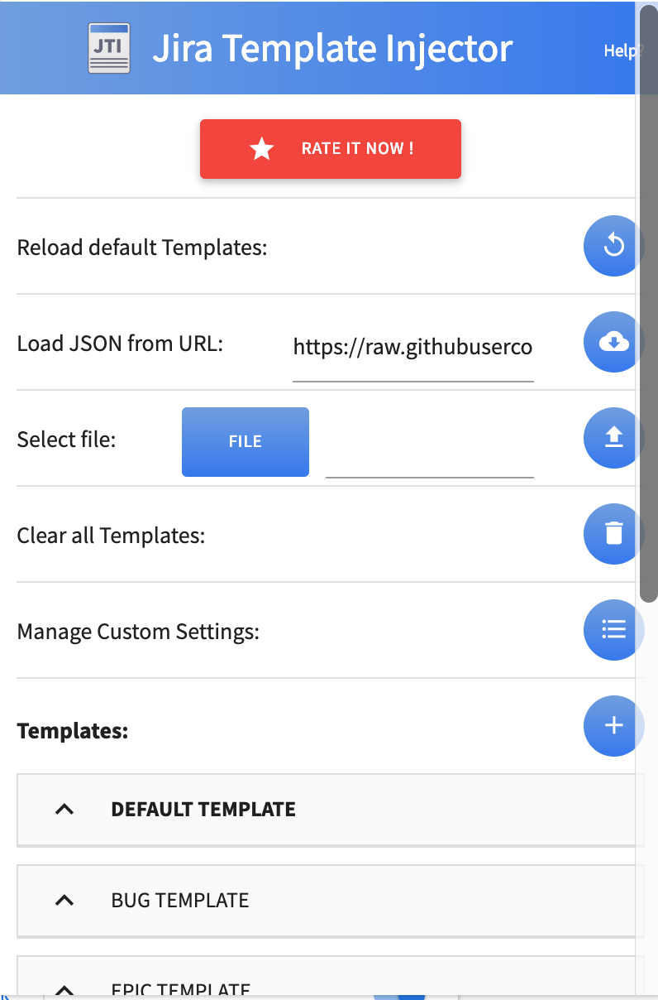

# jira-template
Our ticket template for developers communication.  

# How to use
1. install chrome extension [JIRA Template Injector](https://chrome.google.com/webstore/detail/jira-template-injector/hmhpegjieopgbdmpocdmfkafjgcdmhha)
2. Invoke Jira Template Injector
3. Load JSON from URL:  
https://raw.githubusercontent.com/justincase-jp/jira-template/master/template.en.ja.json

